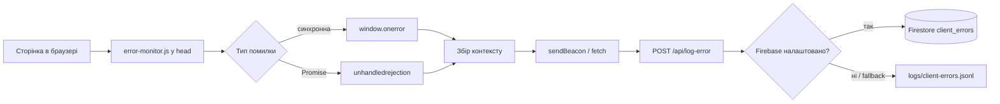

# Моніторинг критичних помилок клієнта (дипломний артефакт)

## Схема роботи



**Послідовність виконання:** скрипт `/error-monitor.js` підключається в `<head>` **до** бандлів Next.js, тому обробники `window.onerror` і `unhandledrejection` активні навіть якщо React/Next не завантажились або впали під час ініціалізації.

## Порівняння: нативний скрипт vs Sentry

| Критерій | Нативний `error-monitor.js` | Sentry / аналоги |
|----------|----------------------------|------------------|
| Залежність від npm на клієнті | Немає | Так (SDK у бандлі) |
| Розмір бандлу | ~2 KB окремим файлом у `public/` | Десятки–сотні KB у main chunk |
| Запуск до падіння фреймворку | Так (окремий `<script>` у `head`) | Залежить від інтеграції; часто після hydration |
| Помилки завантаження `_next/static` | Можна зафіксувати (скрипт уже працює) | Часто ні, якщо SDK у тому ж бандлі |
| Source maps, breadcrumbs, release health | Потрібна власна реалізація | З коробки |
| Алерти, дашборди, sampling | Власний backend / Firebase | Готові |
| Vendor lock-in | Мінімальний | Високий |
| Відповідність задачі диплому | Демонстрація клієнтської архітектури | Готова SaaS-рішення |

**Ключова перевага власного методу для дослідження:** незалежність від розміру основного бандлу та гарантоване раннє виконання моніторингу, коли фреймворк ще не ініціалізований або JS-бандл не завантажився.

## Файли реалізації

| Файл | Призначення |
|------|-------------|
| `utils/monitors/error-monitor.js` | Vanilla JS: `onerror`, `unhandledrejection`, `sendBeacon` |
| `app/layout.tsx` | Підключення скрипта в `<head>` |
| `app/api/log-error/route.ts` | POST endpoint |
| `lib/error-log-storage.ts` | Firestore + fallback у файл |
| `app/dev/error-monitor-test/page.tsx` | QA сторінка |
| `app/dev/error-monitor-dashboard/page.tsx` | Дашборд візуалізації (vanilla JS + Canvas) |
| `utils/monitors/error-monitor-dashboard.js` | Логіка графіків і таблиці |

## План перевірки (PoC)

### Тест 1 — штучна помилка React

1. `npm run dev`
2. Відкрити [http://localhost:3000/dev/error-monitor-test](http://localhost:3000/dev/error-monitor-test)
3. Сторінка «зламається» (overlay помилки в dev), у сховищі з’явиться запис з `message: "Test Crash"`.

### Тест 2 — блокування бандла Next.js

1. Chrome DevTools → Network → правий клік → Block request domain / Add pattern `*_next/static*`
2. Перезавантажити будь-яку сторінку
3. UI може не відрендеритись; якщо помилка потрапляє в `window.onerror` (наприклад, через `<script>`), запис з’явиться в логах.

### Перевірка збереження

- **Без Firebase:** `logs/client-errors.jsonl` (один JSON на рядок)
- **З Firebase:** колекція `client_errors` у Firestore Console

### Приклад запису

```json
{
  "message": "Test Crash",
  "source": null,
  "line": null,
  "column": null,
  "stack": "Error: Test Crash\n    at ...",
  "type": "window.onerror",
  "url": "http://localhost:3000/dev/error-monitor-test",
  "userAgent": "Mozilla/5.0 ...",
  "timestamp": "2026-05-29T12:00:00.000Z",
  "receivedAt": "2026-05-29T12:00:00.100Z",
  "serverEnv": "development"
}
```

## Налаштування Firestore

1. Firebase Console → Project Settings → Service accounts → Generate new private key
2. Скопіювати `project_id`, `client_email`, `private_key` у `.env.local`
3. Перезапустити `npm run dev`
4. Переконатися, що правила Firestore дозволяють запис лише з Admin SDK (клієнт напряму в Firestore не пише)
